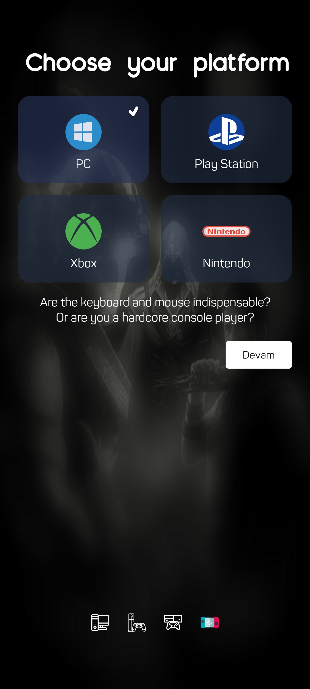
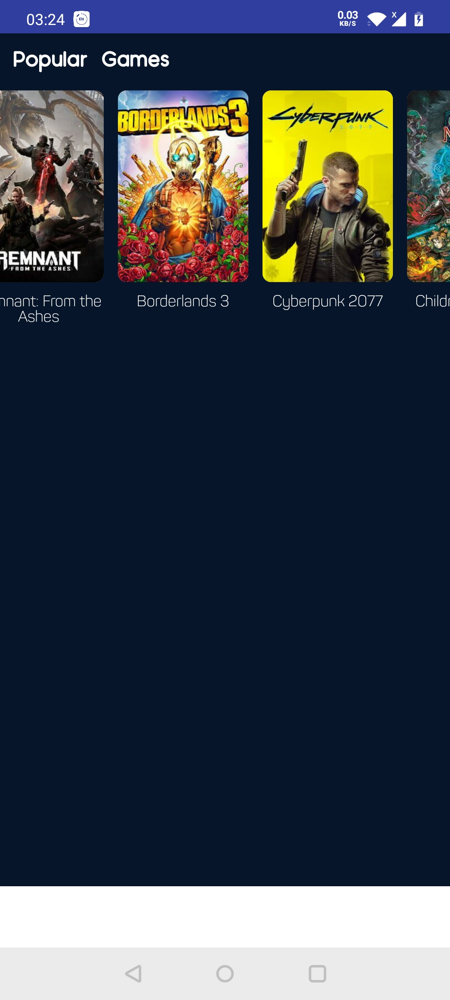

# Project description
[](https://circleci.com/gh/abalta/WASD-Modular)
[](https://kotlinlang.org)
[](https://android-arsenal.com/api?level=21)
[](https://developer.android.com/studio)

This project is open source part for my ongoing development. I present modern Android application architecture that is modular with dynamic feature.

## Project characteristics

This project brings to table set of best practices, tools, and solutions:

* Modern architecture (feature modules, Clean Architecture, Model-View-ViewModel)
* [Android Jetpack](https://developer.android.com/jetpack)
* CI pipeline
* Dependency Injection with Koin
* Material design

## Tech-stack

* Libraries and Framworks
    * [Kotlin](https://kotlinlang.org/) + [Coroutines](https://kotlinlang.org/docs/reference/coroutines-overview.html) - perform background operations
    * [Koin](https://insert-koin.io/) - dependency injection
    * [Retrofit](https://square.github.io/retrofit/) - networking
    * [Jetpack](https://developer.android.com/jetpack)
        * [Navigation](https://developer.android.com/topic/libraries/architecture/navigation/) - deal with whole in-app navigation
        * [LiveData](https://developer.android.com/topic/libraries/architecture/livedata) - notify views about database change
        * [Lifecycle](https://developer.android.com/topic/libraries/architecture/lifecycle) - perform action when lifecycle state changes
        * [ViewModel](https://developer.android.com/topic/libraries/architecture/viewmodel) - store and manage UI-related data in a lifecycle conscious way
        * [Room](https://developer.android.com/topic/libraries/architecture/room) - persistence library provides an abstraction layer over SQLite to allow for more robust database access while harnessing the full power of SQLite.
        * [Pagination](https://developer.android.com/topic/libraries/architecture/paging) - helps you load and display small chunks of data at a time. Loading partial data on demand reduces usage of network bandwidth and system resources.
        * [Data Binding](https://developer.android.com/topic/libraries/data-binding) - allows you to bind UI components in your layouts to data sources in your app using a declarative format rather than programmatically.
    * [Stetho](http://facebook.github.io/stetho/) - application debugging tool
* Architecture
    * Clean Architecture (at module level)
    * MVVM Pattern
    * [Dynamic feature modules](https://developer.android.com/studio/projects/dynamic-delivery)
* Gradle
    * [Gradle Kotlin DSL](https://docs.gradle.org/current/userguide/kotlin_dsl.html)

## Getting Started

This project uses IGDB Api for fetching datas. You need to get Api key for services the app uses.

-   IGDB: https://api-docs.igdb.com/#about

When you obtain the key, you can provide them to the app by putting the following in the `gradle.properties` project root file:

```properties
#IGDB API KEY
apiToken = <insert>
```

## Architecture

Each module has own Clean Architecture layers.

-   `:core` module only responsible for implement common dependencies, holds remote (Retrofit) and cache (Room) repositories.
-   `:onboarding` module is install-time delivery feature module, this module install when app is downloaded. (Uninstall this module is upcoming development progress.)
-   `:home` module is install-time delivery feature module, this module install when app is downloaded.
-   `:app` this is simple application module, this is responsible for navigate feature modules.

## Showroom - UI

[OnboardingActivity](https://github.com/abalta/Kotlin-DynamicFeature-Clean/blob/master/onboarding/src/main/java/com/mobiaxe/onboarding/presentation/OnboardingActivity.kt)

| Module        |  OnboardingFragments                          | ViewPager2 - TabLayout                        | MaterialAndroid                               | SelectPlatformFragment                                  |
|---------------|-----------------------------------------------|-----------------------------------------------|-----------------------------------------------|---------------------------------------------------------|
| `:onboarding` |  |  |  |         |

[DashboardActivity](https://github.com/abalta/Kotlin-DynamicFeature-Clean/blob/master/app/src/main/java/com/mobiaxe/wasd/dashboard/DashboardActivity.kt)

| Module        |  HomeFragment - BottomNavigationView          | Pagination - Horizontal RecyclerView          | NavigationComponent                           |
|---------------|-----------------------------------------------|-----------------------------------------------|-----------------------------------------------|
| `:home`       |          |                                               |                                               |